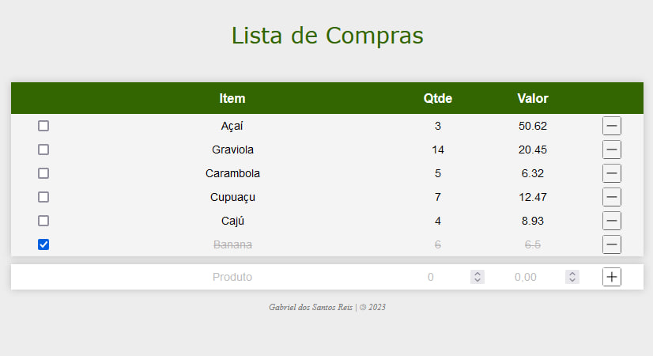

# MVP 1 - Desenvolvimento Full Stack Básico

## PUC-Rio Digital - Desenvolvimento em Full Stack (2023)

Coordenação: [Marcos Kalinowski](kalinowski@inf.puc-rio.br).

Professores: [Fernando Correia](fernando.correia.jr@gmail.com), [Dieinison Braga](dieinisonbraga@gmail.com) e [Marisa Silva](https://github.com/marisa-ec).

Aluno: [Gabriel dos Santos Reis](https://github.com/gaelsreis).

---

## Front-End

> *O Produto Mínimo Viável / Minimum Viable Product (MVP) envolve a criação de uma Aplicação de Tela Única / Single-Page Application (SPA), com as funções de buscar, inserir e excluir itens em uma lista. Foram utilizados HTML, CSS e JavaScript.*

Abrir o projeto no [Firefox](http://localhost:5000/#/)

Abrir o projeto no [Chrome](http://127.0.0.1:5000/)
